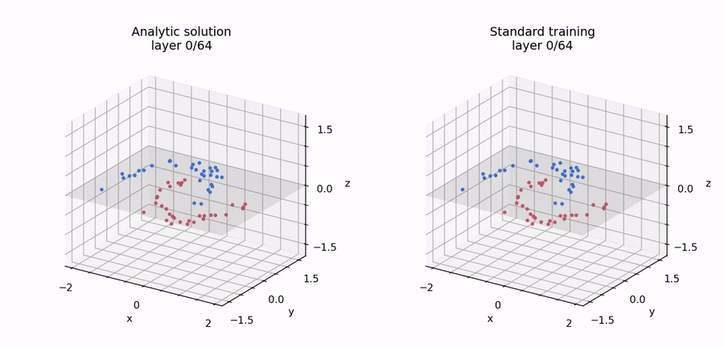
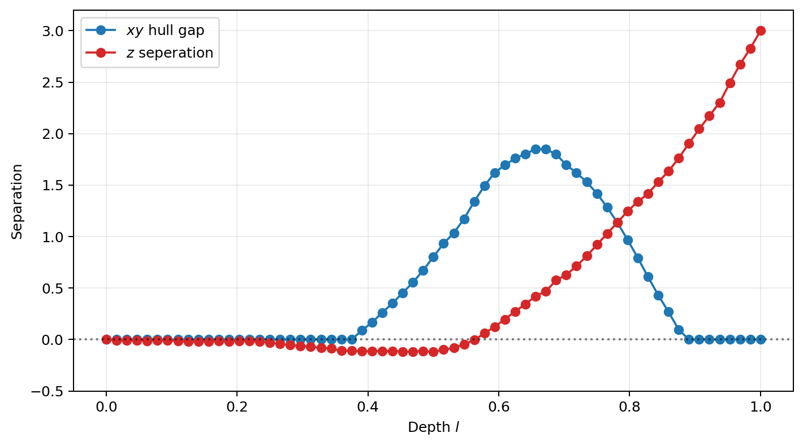
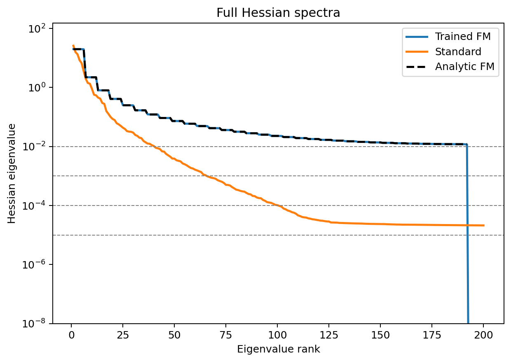

# Neuron Redundancy Biases ResNets Toward Collective Transport

We why an overparameterized ResNet may learn a collective, class-level solution even when it has enough capacity to transport every training sample independently.

The central hypothesis is:

1. **Entropic bias favors neuron redundancy.**
2. **Neuron redundancy produces collective transport.**
3. **Collective transport may support generalization.**

## Setup

We can interpret a depth L ResNet as a discrete dynamical system,

```math
h^{(\ell+1)}
=
h^{(\ell)}
+
\frac{1}{L}f_\ell\left(h^{(\ell)}\right),
```

where depth plays the role of time and each residual block defines a velocity field in representation space.

For a two-class crescent-moon dataset, we embed the two-dimensional inputs in the $z=0$ plane and assign targets at $z=1$ for class A (red) and $z=-1$ for class B (blue). We compare the network optimized solution (right) to an analytic solution (left) in Figure 1 below.

<br>
<p align="center">
  
</p>

<p align="center">
  <em>Figure 1. Analytic sample-wise transport (left) and optimized collective transport (right).</em>
</p>
<br>

The analytic solution can be found by assigning straight line paths to each sample and evolving them in $l$ towards their targets. The optimized network instead appears to cluster the samples into classes first, and then evolve them collectively towards the target.

<p align="center">
  
</p>

<p align="center">
  <em>Figure 2. Evolution of class separation through network depth, measured using the convex-hull gap.</em>
</p>

<p align="center">
  
</p>

<p align="center">
  <em>Figure 3. Hessian spectra of the analytic sample-wise and optimized collective solutions.</em>
</p>

## Two solutions

### Analytic sample-wise solution

When the residual-block width is at least the number of training samples, the neuron boundaries can be chosen so that every sample has a distinct activation pattern. The output weights can then assign each sample its own velocity.

This produces an exact zero-loss solution in which every sample follows a prescribed straight trajectory to its target. The construction is highly sample-specific and finely tuned.

### Optimized collective solution

Standard endpoint training with Adam finds a qualitatively different solution:

1. The samples reorganize until the two classes become approximately linearly separable.
2. The classes then move collectively toward their targets.
3. Only small within-class corrections remain.

Thus, despite having enough capacity to interpolate sample by sample, the trained network discovers shared class-level dynamics.

## Evidence for neuron collapse

Near the depth at which the classes become linearly separable, many neurons begin to separate the classes individually. Their activation patterns are also strongly aligned: the activation matrix restricted to these neurons is approximately low rank, with one dominant singular mode.

These neurons therefore behave approximately like copies of one effective class gate. The leading mode generates collective class motion, while subleading modes permit smaller within-class adjustments.

## Why redundancy may be preferred

If $M$ neurons have identical activation patterns, the network depends only on one collective combination of their output weights. Redistributing this contribution among the neurons leaves the represented function unchanged, producing one collective direction and $M-1$ flat relative directions.

Approximate neuron collapse turns these exactly flat directions into weakly curved directions. This predicts that the small Hessian eigenvalues should be controlled by deviations from the shared activation pattern.

Consistent with this picture, the optimized collective solution has:

- a more rapidly decaying Hessian spectrum;
- fewer resolved quadratic directions at fixed scale;
- lower local free energy under isotropic parameter perturbations;
- broader low-loss neighborhoods than the analytic sample-wise solution.

The current evidence therefore supports—but does not yet prove—the mechanism

```math
\text{neuron redundancy}
\longrightarrow
\text{softer loss geometry}
\longrightarrow
\text{entropic preference for collective transport}.
```

## Main takeaway

Overparameterization does not necessarily bias a network toward sample-wise memorization. In this system, optimization instead finds a redundant representation in which many neurons implement nearly the same class-level operation, creating a broader region of parameter space and transporting samples collectively.

The main open problem is to derive quantitatively how subleading activation modes lift the flat directions and determine the small Hessian eigenvalues.
